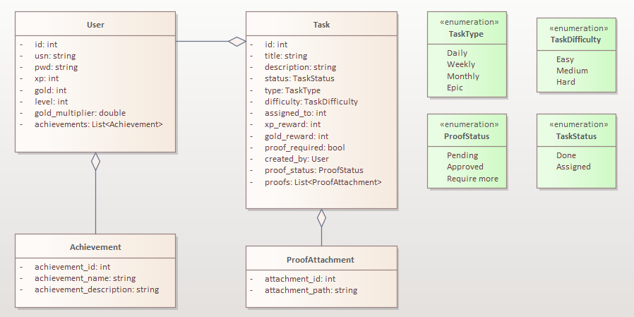

# Software Requirements Specification (SRS)

## 1. Introduction

### 1.1 Purpose

This document defines the functional and non-functional requirements for a task management web application designed in RPG style, where users can assign and complete tasks in a gamified manner. The primary goal is to make task management more engaging and structured.

### 1.2 Scope

The application will allow:

-   Task creation, assignment, and tracking.
-   A gamified experience with levels, rewards, and achievements.
-   A dashboard to monitor progress and statistics.
-   User authentication and role-based access control.
-   A task board where both users can post tasks publicly.
-   A system for daily, weekly, and monthly tasks.
-   Task proof submission and approval.

This application will be built using React for the frontend and Express.js for the backend, with MySQL as the database.

### 1.3 Definitions and Acronyms

-   **Task Giver**: The user who assigns tasks.
-   **Task Receiver**: The user who performs assigned tasks.
-   **XP (Experience Points)**: Earned by completing tasks to level up.
-   **Gold**: A virtual currency used for unlocking perks, with higher XP granting a higher gold multiplier.
-   **Quest**: A task posted on the task board, available for completion.
-   **Proof of Completion**: Evidence (image or text) that a task has been completed.

## 2. Overall Description

### 2.1 Product Perspective

The system will function as a single-page web application (SPA) with a dynamic user interface powered by React. The backend will handle data processing and task management through a RESTful API.

### 2.2 User Characteristics

-   **Both users can create and assign tasks**.
-   **Both users can pick up tasks from the task board** (but cannot complete their own tasks).
-   **Tasks can be daily, weekly, or monthly**.
-   **Proof of completion is required for validation**.
-   **Task creators can approve, disapprove, or request additional proof.**

### 2.3 Constraints

-   Must be hosted locally or on a private server.
-   Should work on modern web browsers.
-   Must be responsive for both desktop and mobile.

## 3. Functional Requirements

### 3.1 User Authentication

-   Users must log in using a unique username and password.
-   Session management will keep users logged in until manually logged out.

### 3.2 Task Management

-   **Task Creation**: Any user can create tasks and post them on the task board.
-   **Task Types**: Tasks can be categorized as daily, weekly, or monthly.
-   **Task Acceptance**: Users can accept tasks from the board but cannot accept their own tasks.
-   **Task Completion**: Users must upload proof of completion (images or text).
-   **Task Approval Process**:
    -   The task creator reviews the proof of completion.
    -   The task creator can **approve**, **disapprove**, or **request additional proof**.
    -   If disapproved or additional proof is requested, the task receiver can submit a revised proof.
-   **Task Statistics**: A dashboard displays completed tasks categorized by type (daily, weekly, monthly).

### 3.3 Gamification Features

-   **XP System**: Completing tasks earns XP, allowing users to level up.
-   **Gold & Rewards**: Completing tasks grants gold, and XP affects the gold multiplier (higher XP = more gold).
-   **Achievements**: Special badges for milestones (e.g., “100 Tasks Completed”).

### 3.4 Dashboard & Analytics

-   **Task Summary**: Overview of assigned and completed tasks.
-   **XP & Gold Stats**: Displays current level, earned XP, available gold, and multiplier effects.
-   **Progress Tracking**: Graphs showing task completion trends.

### 3.5 Notifications

-   Users receive notifications when a task is assigned, completed, or requires approval.
-   Users receive notifications if additional proof is requested or if a task is disapproved.

## 4. Non-Functional Requirements

### 4.1 Performance Requirements

-   The system should handle at least 100 active users concurrently.
-   Responses should be processed within 1 second for most actions.

### 4.2 Security Requirements

-   All passwords should be hashed using bcrypt.
-   User roles must be enforced via middleware.

### 4.3 Usability Requirements

-   The UI should be intuitive and user-friendly.
-   The system should be mobile-friendly.

## 5. System Models

### 5.1 Class Diagram

## 6. Future Enhancements

-   **Multiplayer Mode**: Multiple users can participate in quests.
-   **Customizable Avatars**: Users can choose an avatar to represent their RPG character.
-   **Voice Commands**: Users can interact with the system using voice commands.

---

This SRS provides a structured approach to developing the gamified task management system. Any modifications or additions can be made based on further user feedback.
